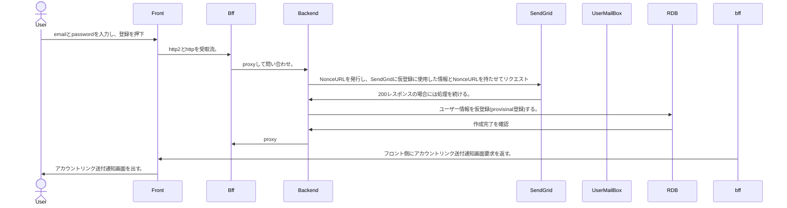

# OAuth2.0を使わないUserAPIのシーケンスドキュメント

## EmailでSignUpする



## OAuthでユーザー登録


``` mermaid

    actor User
    participant Front
    participant Bff
    participant OIDC
    participant Backend
    participant SendGrid
    participant UserMailBox
    participant RDB

    User ->> Front: OAuthボタン押下
    Front ->> Bff: OIDCに問い合わせるためのリクエスト送信
    Bff ->> OIDC: OIDC問い合わせ
    OIDC ->> Bff: 認証許可を出す。
    Bff ->> Backend: 仮登録要求
    Backend ->> Bff: 仮登録を完了し、ユーザーを作成する。
    Bff ->> Frontend: 本登録画面遷移を返す。

    User ->> Front: 個人情報入力
    Front ->> Backend: バックエンド側にCreateUserProfileをリクエスト
    Backend ->> RDB: UserProfileのアップデート要求を行う
    RDB ->> Backend: アプデ成功
    Backend ->> Front: トークンとホーム画面遷移を返す。
    Front ->> Use: ホーム画面を表示する。
```


## ユーザー登録

``` mermaid

    actor User
    participant Front
    participant Bff
    participant Backend
    participant SendGrid
    participant UserMailBox
    participant RDB

    User ->> Front: 個人情報入力
    Front ->> Backend: バックエンド側にCreateUserProfileをリクエスト
    Backend ->> RDB: UserProfileのアップデート要求を行う
    RDB ->> Backend: アプデ成功
    Backend ->> Front: トークンとホーム画面遷移を返す。
    Front ->> Use: ホーム画面を表示する。

```

## 友達追加

## チーム作成

## チームに友達追加

## 記録

## 友達対戦

## チーム戦(チーム対抗)

## チーム内対戦
