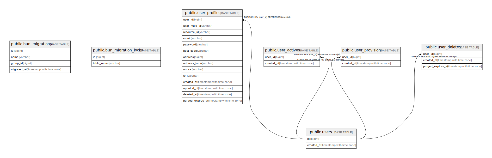

# chatapp

## テーブル一覧

| 名前 | カラム一覧 | コメント | タイプ |
| ---- | ------- | ------- | ---- |
| [public.bun_migrations](public.bun_migrations.md) | 4 |  | BASE TABLE |
| [public.bun_migration_locks](public.bun_migration_locks.md) | 2 |  | BASE TABLE |
| [public.users](public.users.md) | 2 |  | BASE TABLE |
| [public.user_profiles](public.user_profiles.md) | 14 |  | BASE TABLE |
| [public.user_actives](public.user_actives.md) | 2 |  | BASE TABLE |
| [public.user_provision](public.user_provision.md) | 2 |  | BASE TABLE |
| [public.user_deletes](public.user_deletes.md) | 3 |  | BASE TABLE |

## Enums

| 名前 | Values |
| ---- | ------- |
| public.status_enum | active, deleted, inactive, provisioning, purged, unspecified |

## ER図

---

> Generated by [tbls](https://github.com/k1LoW/tbls)
