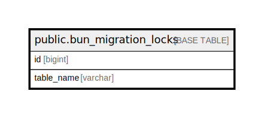

# public.bun_migration_locks

## 概要

## カラム一覧

| 名前 | タイプ | デフォルト値 | Nullable | 子テーブル | 親テーブル | コメント |
| ---- | ------ | ------------ | -------- | ---------- | ---------- | -------- |
| id | bigint | nextval('bun_migration_locks_id_seq'::regclass) | false |  |  |  |
| table_name | varchar |  | true |  |  |  |

## 制約一覧

| 名前 | タイプ | 定義 |
| ---- | ---- | ---------- |
| bun_migration_locks_pkey | PRIMARY KEY | PRIMARY KEY (id) |
| bun_migration_locks_table_name_key | UNIQUE | UNIQUE (table_name) |

## INDEX一覧

| 名前 | 定義 |
| ---- | ---------- |
| bun_migration_locks_pkey | CREATE UNIQUE INDEX bun_migration_locks_pkey ON public.bun_migration_locks USING btree (id) |
| bun_migration_locks_table_name_key | CREATE UNIQUE INDEX bun_migration_locks_table_name_key ON public.bun_migration_locks USING btree (table_name) |

## ER図

---

> Generated by [tbls](https://github.com/k1LoW/tbls)
