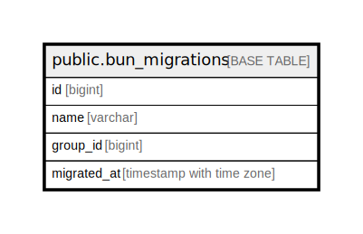

# public.bun_migrations

## 概要

## カラム一覧

| 名前 | タイプ | デフォルト値 | Nullable | 子テーブル | 親テーブル | コメント |
| ---- | ------ | ------------ | -------- | ---------- | ---------- | -------- |
| id | bigint | nextval('bun_migrations_id_seq'::regclass) | false |  |  |  |
| name | varchar |  | true |  |  |  |
| group_id | bigint |  | true |  |  |  |
| migrated_at | timestamp with time zone | CURRENT_TIMESTAMP | false |  |  |  |

## 制約一覧

| 名前 | タイプ | 定義 |
| ---- | ---- | ---------- |
| bun_migrations_pkey | PRIMARY KEY | PRIMARY KEY (id) |

## INDEX一覧

| 名前 | 定義 |
| ---- | ---------- |
| bun_migrations_pkey | CREATE UNIQUE INDEX bun_migrations_pkey ON public.bun_migrations USING btree (id) |

## ER図

---

> Generated by [tbls](https://github.com/k1LoW/tbls)
