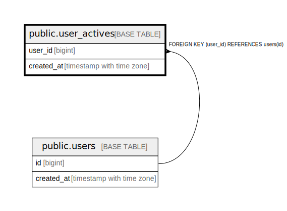

# public.user_actives

## 概要

## カラム一覧

| 名前 | タイプ | デフォルト値 | Nullable | 子テーブル | 親テーブル | コメント |
| ---- | ------ | ------------ | -------- | ---------- | ---------- | -------- |
| user_id | bigint |  | false |  | [public.users](public.users.md) |  |
| created_at | timestamp with time zone |  | false |  |  |  |

## 制約一覧

| 名前 | タイプ | 定義 |
| ---- | ---- | ---------- |
| user_actives_user_id_fkey | FOREIGN KEY | FOREIGN KEY (user_id) REFERENCES users(id) |
| user_actives_user_id_key | UNIQUE | UNIQUE (user_id) |

## INDEX一覧

| 名前 | 定義 |
| ---- | ---------- |
| user_actives_user_id_key | CREATE UNIQUE INDEX user_actives_user_id_key ON public.user_actives USING btree (user_id) |

## ER図

---

> Generated by [tbls](https://github.com/k1LoW/tbls)
