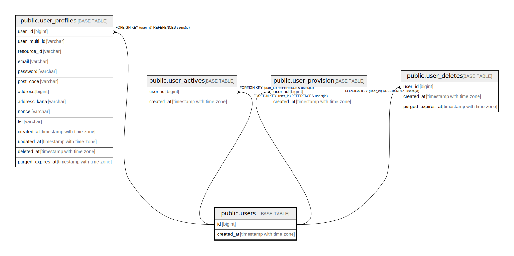

# public.users

## 概要

## カラム一覧

| 名前 | タイプ | デフォルト値 | Nullable | 子テーブル | 親テーブル | コメント |
| ---- | ------ | ------------ | -------- | ---------- | ---------- | -------- |
| id | bigint | nextval('users_id_seq'::regclass) | false | [public.user_profiles](public.user_profiles.md) [public.user_actives](public.user_actives.md) [public.user_provision](public.user_provision.md) [public.user_deletes](public.user_deletes.md) |  |  |
| created_at | timestamp with time zone |  | false |  |  |  |

## 制約一覧

| 名前 | タイプ | 定義 |
| ---- | ---- | ---------- |
| users_pkey | PRIMARY KEY | PRIMARY KEY (id) |

## INDEX一覧

| 名前 | 定義 |
| ---- | ---------- |
| users_pkey | CREATE UNIQUE INDEX users_pkey ON public.users USING btree (id) |

## ER図

---

> Generated by [tbls](https://github.com/k1LoW/tbls)
